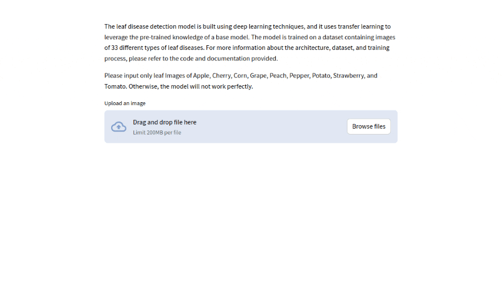

# Leaf Disease Detection using Deep Learning

<!--  -->


This project is a leaf disease detection system that uses deep learning techniques, including transfer learning, to identify and classify 3 different types of leaf diseases. The model has been trained on a dataset containing 900 images, with 300 images for each disease class. This diverse dataset helps ensure that the model can accurately diagnose each disease. Designed for agricultural professionals and enthusiasts, this tool enables fast and accurate plant disease detection.

## Basic Information About Leaf Diseases
Leaf diseases are a major concern in agriculture, as they can significantly impact crop health and yield. These diseases are typically caused by fungi, bacteria, or environmental stressors that lead to visible symptoms on leaves, such as spots, discoloration, and wilting. Early detection and diagnosis are crucial to manage these diseases and minimize crop loss.

The three leaf disease classes identified in this model include:

- **Corn-Common Rust**: This disease appears as red or brown pustules on corn leaves, typically spread by fungal spores. Common rust can reduce crop yield by affecting photosynthesis.
  
- **Potato-Early Blight**: Early blight in potatoes is caused by the *Alternaria solani* fungus, leading to circular or irregular dark spots on leaves. It can spread rapidly in warm and humid conditions.
  
- **Tomato-Bacterial Spot**: Caused by bacteria, this disease appears as water-soaked spots on tomato leaves and stems. It affects photosynthesis and reduces the overall quality of tomato fruits.

## Usage

To use the model for leaf disease detection, follow these steps:

1. Make sure you have a Python environment set up with the necessary libraries installed. You can use the provided requirements.txt file to set up the required dependencies.

   ```bash
   pip install -r requirements.txt
2. Run main.py

```
streamlit run main.py 
```

## Model Details
The leaf disease detection model is built using deep learning techniques, and it uses transfer learning to leverage the pre-trained knowledge of a base model. The model is trained on a dataset containing images of 33 different types of leaf diseases. For more information about the architecture, dataset, and training process, please refer to the code and documentation provided.


## Acknowledgments
We would like to acknowledge the contributions of the open-source community and the creators of the base model that this project builds upon. Your work and support are greatly appreciated.